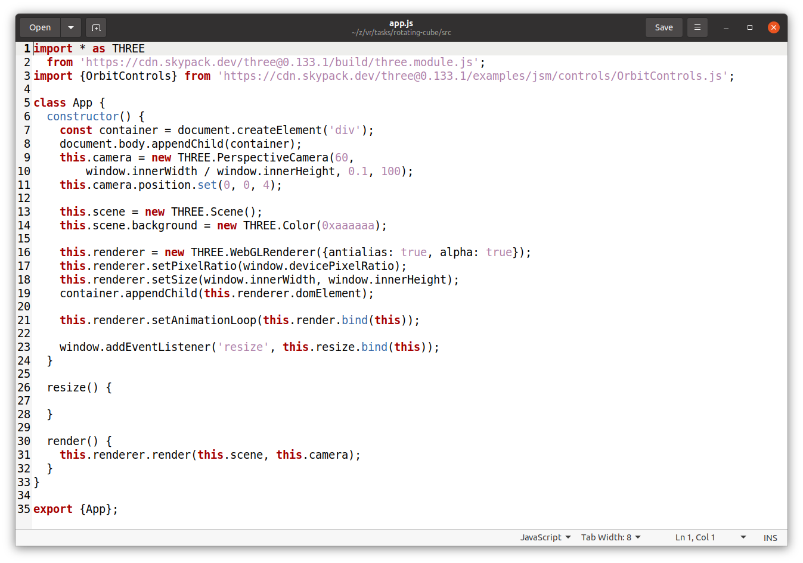
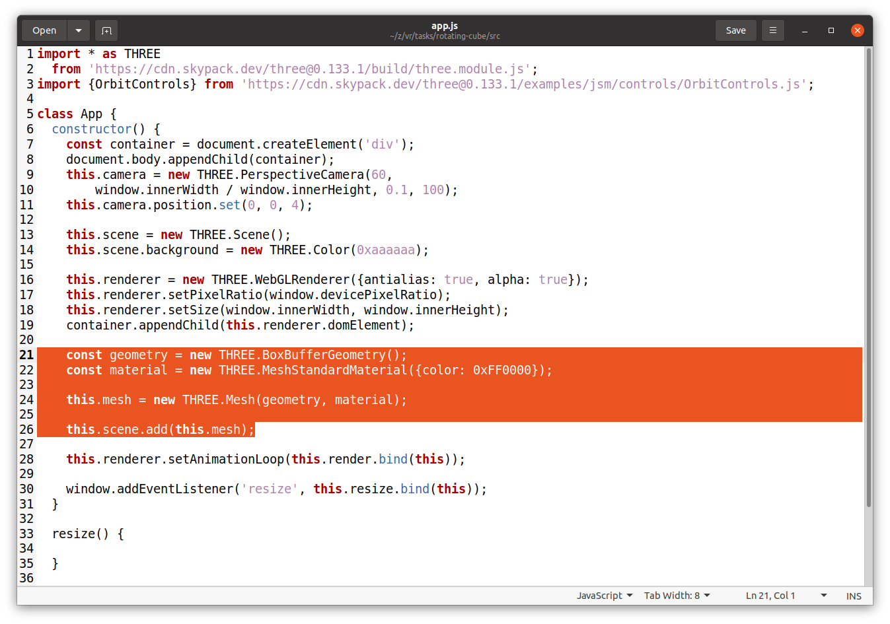
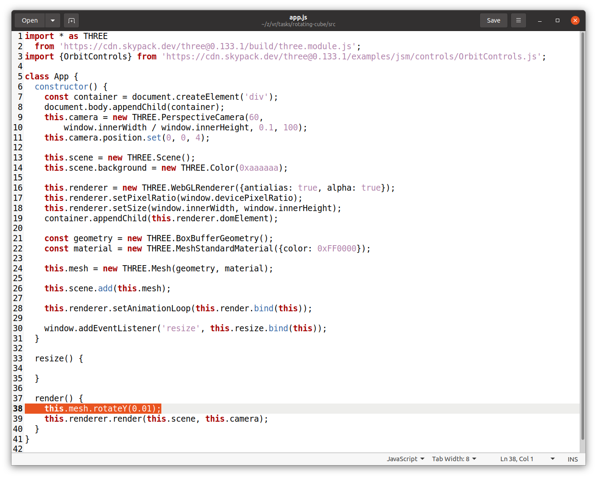
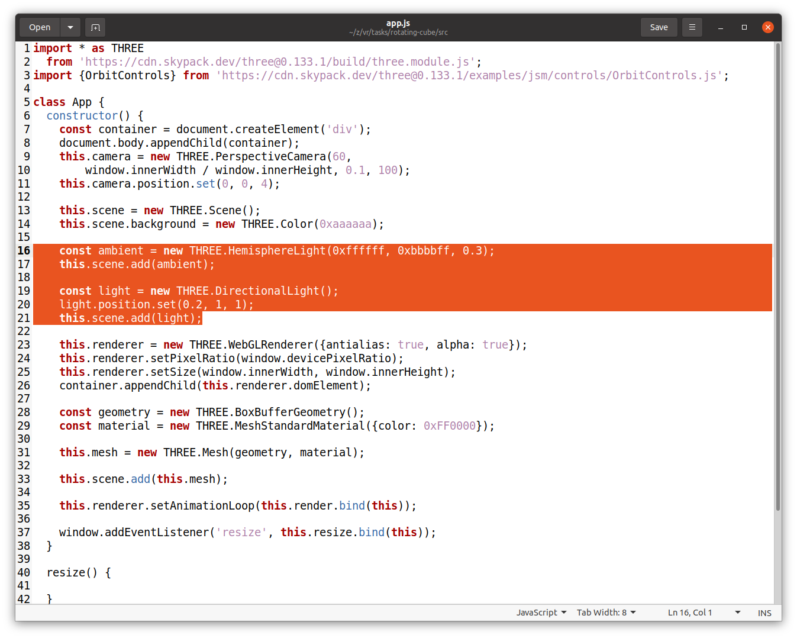
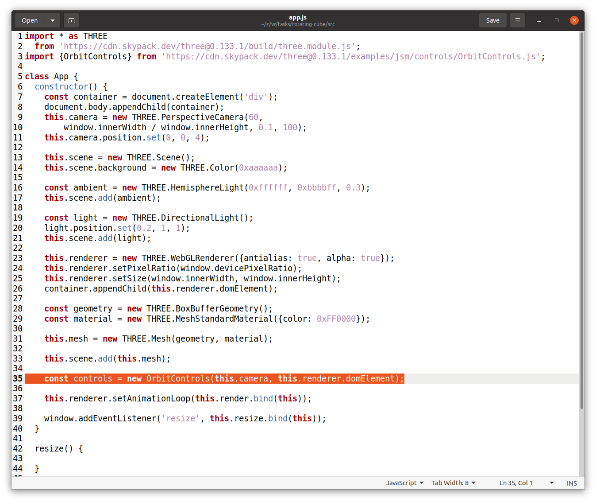
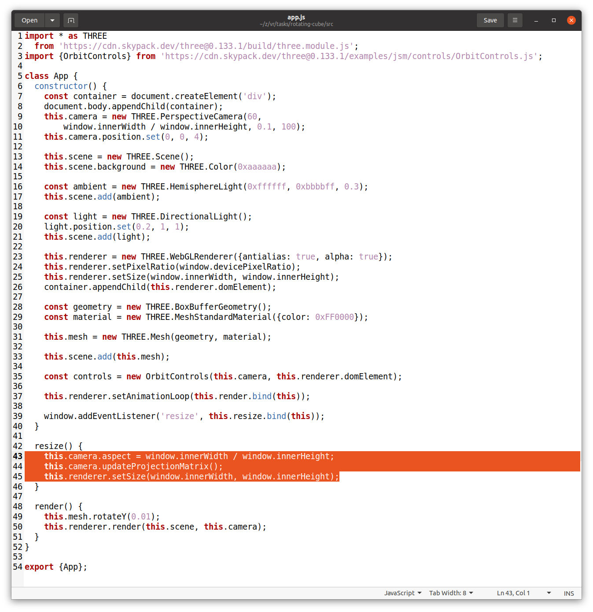

# Rotating Cube

## Step 1 -- Clone

1. Clone to your local machine: `git clone git@github.com:it-zmina/rotating-cube-demo.git`
2. Create empty repository in your Git Hub account with name `rotating-cube`.
3. Insert your data to the `git_settings.sh` script.
4. Invoke `git_settings.sh` script in your Git Bash console: `./git_settings.sh`
5. Set path to your repository: `git remote set-url origin <path to your repository>`
6. Push to your repository: `git push origin master`
7. Check that code successfully deployed to your repository.

## Step2 -- Add canvas with WebGL renderer

1. Add camera, scene and rendered objects to the web application as in the next figure:

## Step3 -- Add cube to the scene

1. Add geometry, material and mesh objects to the app: 

## Step4 -- Add animation

1. Rotate mesh object inside render loop: 

## Step5 -- Add lights

1. Add HemisphereLight and DirectionalLight to the scene: 

## Step6 -- Add user control

1. Add OrbitControls class for rotating scene with the mouse: 

## Step7 -- Update scene when user resize window

1. Update camera aspect ratio and render area on window resize: 